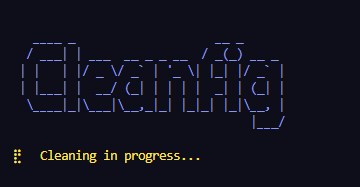
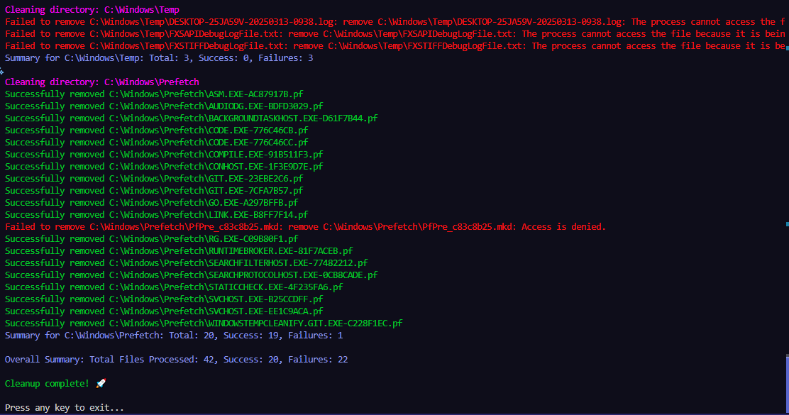

# WindowsTempCleanify

A command-line tool and script written in Go that automates the cleanup of temporary files on Windows. It cleans your user TEMP directory, Windows system temporary directory, Prefetch directory and Recycle Bin.

---

## 

## 

## Features

- **Automated Cleanup:**  
  Removes files from:

  - The user's TEMP `%temp%` directory
  - `C:\Windows\Temp`
  - `C:\Windows\Prefetch`
  - `C:\$Recycle.Bin` recycle bin

- **Interactive TUI:**  
  Uses Bubble Tea to display:

  - A colorful banner
  - A progress spinner
  - Detailed logs for each deletion operation

- **Detailed Metrics:**  
  Provides per-directory and overall summaries:

  - Total files processed
  - Number of successful deletions
  - Number of failures

- **Exit Prompt:**  
  After cleanup, the TUI displays a prompt ("Press any key to exit...") and waits for your input before quitting.

  <!-- download the script -->

## Prerequisites

- **Go 1.18+** – [Download Go](https://golang.org/dl/)
- **Windows OS** – Designed to work on Windows (requires admin privileges for system directories)
- **Terminal with ANSI Color Support** – For the best experience, use Windows Terminal or PowerShell.

## Building Cleanify from Source

If you prefer to build Cleanify yourself rather than downloading a pre-built executable, follow these steps:

1. **Clone the Repository:**

   ```bash
   git clone https://github.com/yourusername/cleanify.git
   cd cleanify
   ```

2. **Initialize the Go Module (if not already initialized):**

   ```bash
   go mod init github.com/yourusername/cleanify
   ```

3. **Download Dependencies:**

   Cleanify uses [Bubble Tea](https://github.com/charmbracelet/bubbletea), [Bubbles (spinner)](https://github.com/charmbracelet/bubbles), and [Fatih's Color](https://github.com/fatih/color). To download these dependencies, run:

   ```bash
   go get github.com/charmbracelet/bubbletea
   go get github.com/charmbracelet/bubbles
   go get github.com/fatih/color
   ```

4. **Build the Executable:**

   Once all dependencies are installed, build the project by running:

   ```bash
   go build -o cleanify.exe
   ```

   This will compile the source code into a Windows executable named `cleanify.exe`.

5. **Run Cleanify:**

   For best results (especially when cleaning system directories), run the executable with administrator privileges:

   - Right-click on `cleanify.exe` and select **Run as administrator**, or
   - Open an elevated PowerShell/Command Prompt and execute:

     ```bash
     .\cleanify.exe
     ```

## Code Overview

The project is implemented in a single Go file (`main.go`) and leverages:

- **Bubble Tea:** For building the TUI.
- **Bubbles (Spinner):** For an animated progress indicator.
- **Fatih's Color:** For colorized terminal output.

Each component is well-commented to help you understand how the cleanup process, logging, and metrics are handled.

## Contributing

Contributions are welcome! Feel free to open issues or submit pull requests for improvements or bug fixes.

## License

This project is licensed under the MIT License. See the [LICENSE](LICENSE) file for more details.

## Disclaimer

Use Cleanify at your own risk. Ensure you back up important data before running cleanup operations. The authors are not liable for any unintended data loss or system issues.
